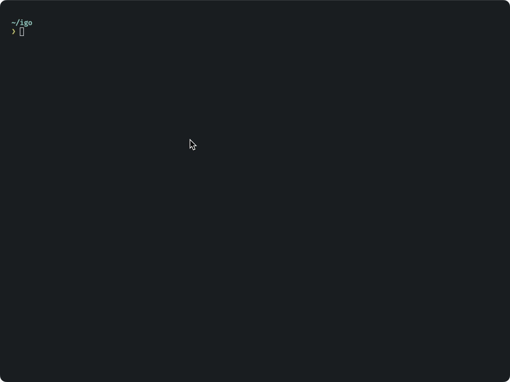

<div align="center">
  <h3 align="center">IGO 📷</h3>

  <p align="center">
    A CLI for Instagram built in Go helps you do some <br> tasks faster and easier like downloading posts, stories, IGTV, and DMs.
  </p>


</div>

<br>

### 🚨 Disclaimer

> **This project** is not affiliated with **Instagram** or **Meta** in any way. It is a personal project that was created to help me learn **Go**. Use at your own risk. I am not responsible for any actions you take with **this tool**. Please do not use **this tool** to **spam** people or do anything **malicious**. **This tool** was built for **educational purposes** only.

<br>

### 🍺 Installation via Homebrew

```sh
brew tap fvrrvg/tap
brew install igo
```

### 🛠️ Build & Run locally

Install [Go](https://golang.org/doc/install) first and run the following commands:

```sh
git clone https://github.com/fvrrvg/igo.git
cd igo
# build
go build .
# run
./igo
```

### 📋 Usage & Available Commands

```sh
igo [flags]
igo [command]
```

#### Available Commands

- `everything`: Download everything.
- `dms`: Download your direct messages with a user.
- `igtv`: Download the IGTVs of a user.
- `posts`: Download posts.
- `stories`: Download stories.
- `highlights`: Download the Highlights of a user.
- `pp`: Download profile picture of a user.
- `logout`: Logout from your account.
- `my`: Download your own posts, stories, IGTV, Highlights.
- `nfb`: Get the users that don't follow you back.
- `follow`: Follow a user.
- `unfollow`: Unfollow a user.
- `whoami`: Get your account's info.
- `download`: Download a post, reel, IGTV just by using the url.

#### Available Flags

##### Global Flags

- `--help/-h`: Help for igo.
- `--username/-u`: Username of the user you want to perform tasks on.

##### Flags for `posts` command

- `--latest/-l`: Download the latest post only.

##### Flags for `nfb` command

- `--json/-j`: Export the users that don't follow you back in JSON format.
- `--exclude-verfied/-e`: Exclude verified users from the list.

##### Flags for `download` command

- `--url`: The url of the post, reel, IGTV you want to download.

### 🙌 Achnowledgements

This project wouldn't be possible without the existance of this amazing project:

- [goinsta](https://github.com/ahmdrz/goinsta) by [ahmdrz](https://github.com/ahmdrz)
- And Thanks to [Davincible](https://github.com/Davincible/) for continuing to work on [it](https://github.com/Davincible/goinsta) ❤️
